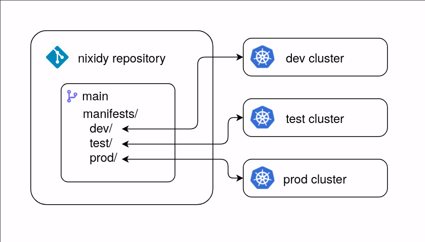
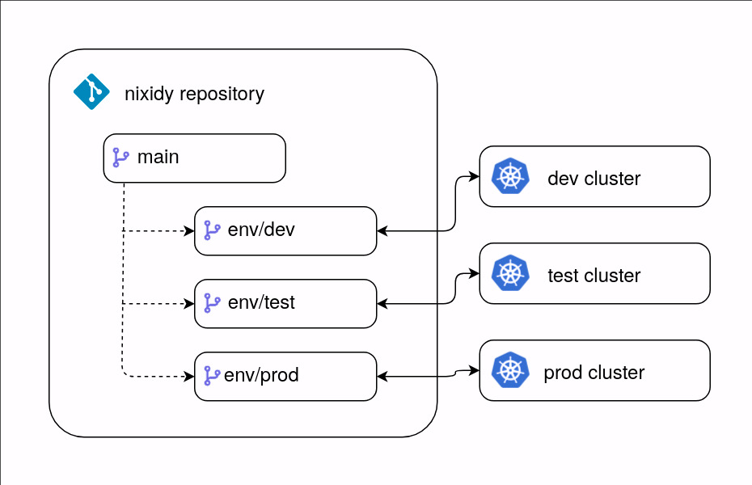
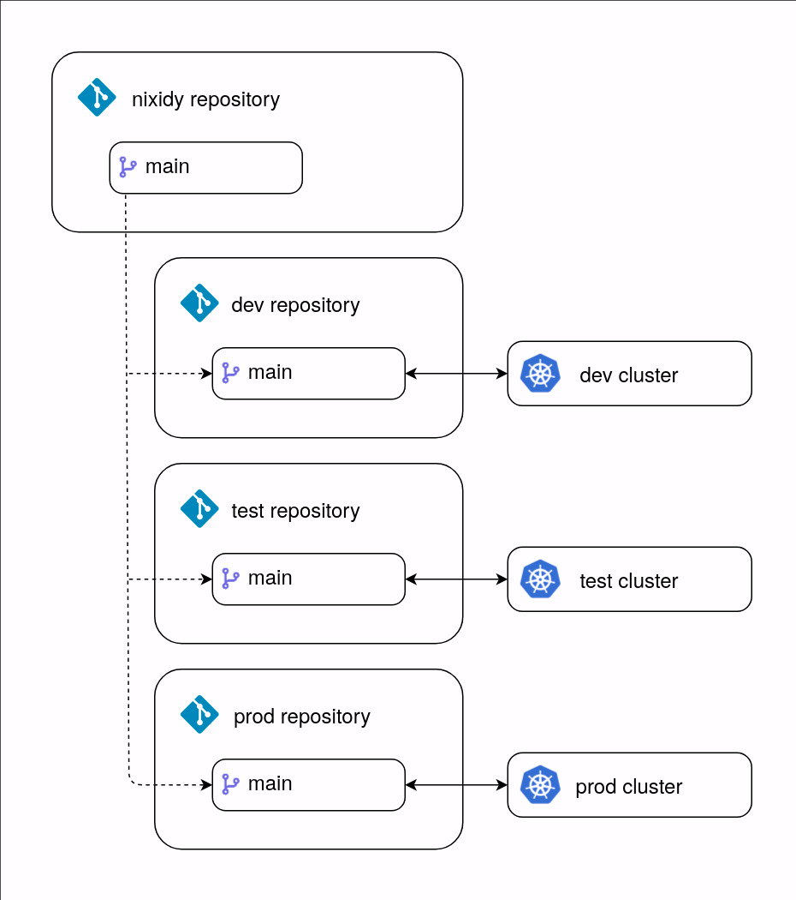

# Git Strategies

When it comes to planning out how to structure the git repositories for your environments some options are available.

## Monorepo

With this strategy everything happens on the `main`/`master` branch. With every change to nixidy modules should result in a rebuild and the resulting manifests will be put in a sub-directory on the same branch.



The biggest gain from using this strategy is fast iteration locally as any change made to a nixidy module can be previewed by running `nixidy switch .#<env>` and then followed by `git diff` to see what has actually changed in the generated manifests.

This strategy does require more complicated access control mechanism such as [CODEOWNER file](https://docs.github.com/en/repositories/managing-your-repositorys-settings-and-features/customizing-your-repository/about-code-owners) to make sure not everyone can change the generated manifests.

### Setup

In a module that's common to all the environment the target repository and branch needs to be set.

```nix title="modules/default.nix"
{
  # Set the target repository for the rendered manifests
  # and applications.
  # This should be replaced with yours.
  nixidy.target.repository = "https://github.com/arnarg/nixidy-demo.git";

  # Set the target branch the rendered manifests for every
  # environment should be pushed to in the repository defined
  # above.
  nixidy.target.branch = "main";
}
```

And in a module that's specific to each environment the target root path needs to be set.

```nix title="env/dev.nix"
{
  # Set the target sub-directory to copy the generated
  # manifests to when running `nixidy switch .#dev`.
  nixidy.target.rootPath = "./manifests/dev";
}
```

!!! tip
    When using `mkEnvs` from nixidy, each environment's `rootPath` is automatically set to `./manifests/${dev}`.

## Environment branches

With this strategy generated manifests are committed and pushed to separate environment specific branches. As these branches will not share any git history with the `main` branch or other environment branches (this is not git flow) they need to be created as orphan branches.



The biggest gain from this strategy is that it's simpler to implement access control compared to the monorepo, the branches can be setup with basic branch protection rules.

### Setup

In a module that's common to all the environments the target repository needs to be set. Unless you want the root path to differ between the environment's that can also be set here.

```nix title="modules/default.nix"
{
  # Set the target repository for the rendered manifests
  # and applications.
  # This should be replaced with yours.
  nixidy.target.repository = "https://github.com/arnarg/nixidy-demo.git";

  # The generated manifests should be at the root of
  # each environment branch.
  nixidy.target.rootPath = "./";
}
```

And in a module that's specific to each environment the target branch needs to be set.

```nix title="env/dev.nix"
{
  # Set the target branch the rendered manifests for _this_
  # environment should be pushed to in the repository defined
  # above.
  nixidy.target.branch = "env/dev";
}
```

!!! info
    The environment branches need to be created manually and they _need_ to be created as orphan branches.

    ```sh
    git checkout --orphan env/dev
    echo "# env/dev" > README.md
    git add README.md
    git commit -m "Initial commmit"
    git push -u origin env/dev
    ```

## Environment repositories

With this strategy generated manifests are committed and pushed to separate repositories entirely.



The biggest gain from this strategy is that it's possible to go even further with access control from the environment branches.

### Setup

In a module that's common to all the branches only the root path should be set, unless that should differ between the environments.

```nix title="modules/default.nix"
{
  # The generated manifests should be at the root of
  # each environment repository.
  nixidy.target.rootPath = "./";
}
```

And in a module that's specific to each environment the target repository and target branch needs to be set.

```nix title="env/dev.nix"
{
  # Set the target repository for the rendered manifests
  # and applications.
  # This should be replaced with yours.
  nixidy.target.repository = "https://github.com/arnarg/nixidy-demo-dev.git";

  # Set the target branch the rendered manifests for _this_
  # environment should be pushed to in the repository defined
  # above.
  nixidy.target.branch = "main";
}
```
